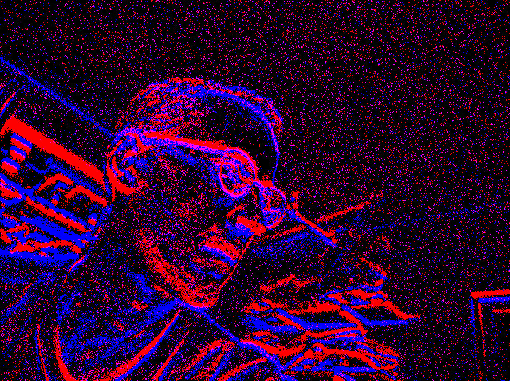
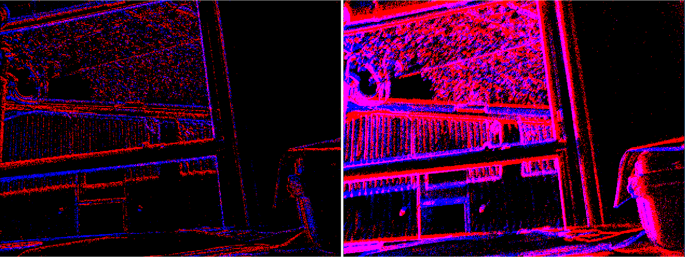

# event_camera_renderer

`event_camera_renderer` 用于将 `event_camera_msgs` 中的事件流渲染成 ROS 图像消息，便于使用 `rqt_image_view` 或其他图像工具查看事件相机输出。



## 当前工作空间状态

本包已纳入 Ultimate SLAM 的 EVK4 可视化链路，会与 `event_camera_msgs`、`event_camera_codecs`、`metavision_driver` 和 `evk4_driver` 一同构建。

## 支持平台

上游持续集成主要覆盖 ROS 2 Humble 及之后版本。ROS 1 已不再支持。

## 使用方式

假设事件相机驱动节点名为 `event_camera`：

```bash
ros2 launch event_camera_renderer renderer.launch.py camera:=event_camera
ros2 run rqt_image_view rqt_image_view
```

在 `rqt_image_view` 中选择以下图像话题：

```text
/event_camera/image_raw
```

渲染器仅在该图像话题出现订阅者后，才会订阅 `/event_camera/events` 并开始生成图像；启动后先显示 `waiting for subscribers` 属正常现象。

播放 rosbag 并使用仿真时间时，时钟播放倍率通常需要高于渲染帧率 `fps`。

## 参数

- `fps`：输出图像频率，单位 Hz，默认 25。
- `max_wait_frames`：等待事件到来的最大帧数，超过后发布空帧，默认 5。
- `display_type`：渲染方式，可选 `time_slice` 或 `sharp`。
  - `time_slice`：聚合相邻帧之间的所有事件。
  - `sharp`：自动控制事件数量，以获得更锐利的特征。

示例图：



在 EVK4 封装包中可直接启动双渲染对比：

```bash
ros2 launch evk4_driver evk4_compare.launch.py serial:=00052316 fps:=25.0
```

它会同时发布 `/event_camera/time_slice/image_raw` 和 `/event_camera/sharp/image_raw`，便于在 `rqt_image_view` 中切换比较。

## 许可证

本软件使用 Apache License 2.0。
