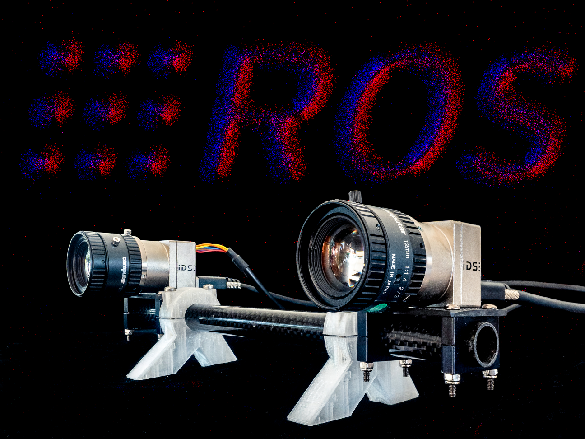

# metavision_driver

`metavision_driver` 是一个基于 Prophesee MetaVision SDK / OpenEB 的 ROS 2 事件相机驱动。它不是 Prophesee 官方维护的驱动。



在当前 `Ultimate SLAM` 工作空间中，本包作为 EVK4 HD 的底层驱动使用，上层封装入口在：

```text
src/evk/evk4_driver
```

推荐日常使用 `evk4_driver` 启动 EVK4，而不是直接调用本包 launch 文件。

## 工作方式

本驱动的设计目标是高吞吐、低拷贝。它主要从相机获取原始事件数据，目前常用格式为 EVT3，然后发布为 ROS `event_camera_msgs`。

相关包：

- `event_camera_msgs`：事件相机消息定义。
- `event_camera_codecs`：C++ 事件解码工具。
- `event_camera_py`：Python 事件解码工具。
- `event_camera_renderer`：将事件流渲染为 ROS 图像。
- `event_camera_tools`：事件 echo、性能监测和格式转换工具。

## 支持平台与硬件

上游测试环境：

- ROS 2 Humble 及之后版本
- MetaVision SDK / OpenEB 5.0.0 及之后版本

曾经可用但当前不再重点测试：

- MetaVision 4.2.0
- MetaVision 4.6.2
- ROS 1 分支，当前已不维护

测试过的硬件：

- IDS uEye XCP-E
- SilkyEVCam VGA，Gen 3.1 传感器
- SilkyEVCam HD，Gen 4 传感器
- Prophesee EVK4，Gen 4 传感器

明确不支持：

- 旧 EVT2 数据
- 当前尚未支持 EVT4 解码

EVK4 HD 当前建议使用 `evt3`。

## 当前工作空间中的使用方式

本工作空间已经将 EVK4 相关逻辑封装在 `evk4_driver`：

```bash
cd "/home/changxin/Ultimate SLAM"
source setup_evk4_driver.bash
ros2 launch evk4_driver evk4_driver.launch.py serial:=00052316
```

查看相机信息：

```bash
ros2 launch evk4_driver info.launch.py
```

录制事件：

```bash
ros2 launch evk4_driver evk4_record.launch.py output:=evk4_events
```

## 二进制安装方式

上游推荐的二进制安装方式：

```bash
sudo apt install ros-${ROS_DISTRO}-metavision-driver
```

该方式会同时安装 OpenEB vendor 到 `/opt/ros/${ROS_DISTRO}`。使用二进制包时仍需安装正确的 udev 规则，否则相机会因为 USB 权限不足而无法打开。

Prophesee EVK 相机需要安装源码树中 `udev/rules.d/` 的规则，并重新加载 udev。

## 源码构建方式

上游源码构建通常需要先安装 OpenEB：

```bash
pkg=metavision_driver
mkdir -p ~/${pkg}_ws/src
cd ~/${pkg}_ws
git clone https://github.com/ros-event-camera/metavision_driver.git src/${pkg}
colcon build --symlink-install \
  --cmake-args -DCMAKE_BUILD_TYPE=RelWithDebInfo -DCMAKE_EXPORT_COMPILE_COMMANDS=ON
source install/setup.bash
```

当前工作空间已经使用 ROS Lyrical 的 OpenEB vendor 解包到 `.local_ros`，因此日常构建只需：

```bash
source setup_evk4_driver.bash
colcon build --symlink-install --allow-overriding event_camera_msgs \
  --cmake-args -DBUILD_TESTING=OFF
```

## 驱动特性

与 Prophesee 官方 ROS wrapper 相比，本驱动更强调：

- 使用 `event_camera_msgs`，消息存储更紧凑，访问更快。
- 尽量减少不必要的内存拷贝，降低 CPU 开销。
- 支持组件化运行，便于和 rosbag 录制节点放在同一进程内。
- 输出消息率和带宽统计，便于判断相机或总线是否接近饱和。
- 支持 bias 参数、ROI、相机同步、外部触发、事件率控制等功能。

## 常用参数

- `bias_file`：bias 文件路径。
- `settings`：相机设置 JSON 文件，例如像素 mask。
- `serial`：指定要打开的相机序列号，多相机时很有用。
- `encoding`：事件数据格式。当前 EVK4 推荐 `evt3`。
- `event_message_time_threshold`：聚合事件消息的最小时间跨度，默认 1 ms。
- `event_message_size_threshold`：聚合事件消息的最小数据量，默认 1 MB。
- `statistics_print_interval`：统计信息打印周期。
- `send_queue_size`：ROS 发布队列大小，默认 1000。
- `use_multithreading`：是否将 SDK 回调和 ROS 发布处理分离。开启后更不容易阻塞 SDK 回调，但会增加一次拷贝和线程开销。
- `frame_id`：ROS 消息头中的 frame id。
- `roi`：硬件 ROI，格式为 `[x, y, width, height, ...]`，长度必须是 4 的倍数。
- `roni`：是否把 ROI 反转为非感兴趣区域。
- `erc_mode`：Gen4 事件率控制模式，可选 `na`、`disabled`、`enabled`。
- `erc_rate`：Gen4 事件率控制目标值，单位 events/s。
- `mipi_frame_period`：MIPI 帧周期，单位微秒。设置过低可能造成数据异常。
- `trail_filter`：是否启用事件轨迹滤波。
- `trail_filter_type`：滤波类型，可选 `trail`、`stc_cut_trail`、`stc_keep_trail`。
- `trail_filter_threshold`：滤波阈值。
- `sync_mode`：多相机同步模式，可选 `standalone`、`primary`、`secondary`。
- `trigger_in_mode`：触发输入模式，可选 `disabled`、`external`、`loopback`。
- `trigger_out_mode`：触发输出模式。注意 Gen4 传感器通常不再支持 trigger out。

## 服务

- `save_biases`：保存当前 bias 参数到文件，需要设置 `bias_file`。
- `save_settings`：保存当前相机设置到文件，需要设置 `settings`。
- `dump_statistics`：输出额外统计信息，例如 SDK packet 平均大小。

## bias 动态参数

常见 bias 参数：

- `bias_diff`
- `bias_diff_off`
- `bias_diff_on`
- `bias_fo`
- `bias_hpf`
- `bias_pr`
- `bias_refr`

具体含义请结合 MetaVision SDK 文档和传感器手册使用。

## 直接运行上游驱动

如需绕过 `evk4_driver` 直接测试底层驱动：

```bash
ros2 launch metavision_driver driver_node.launch.py
```

组件化运行：

```bash
ros2 launch metavision_driver driver_composition.launch.py
```

但在本工作空间中，仍建议优先使用：

```bash
ros2 launch evk4_driver evk4_driver.launch.py
```

## 可视化

启用 `event_camera_renderer` 后，可运行：

```bash
ros2 launch event_camera_renderer renderer.launch.py camera:=event_camera
ros2 run rqt_image_view rqt_image_view
```

当前该包默认被 `COLCON_IGNORE` 忽略，后续需要可视化时再启用。

## 录制

当前工作空间提供封装 demo：

```bash
ros2 launch evk4_driver evk4_record.launch.py output:=evk4_events
```

上游也提供组合式录制 launch，适合对进程间拷贝和高吞吐录制有更高要求的场景。

## CPU 负载参考

上游在 8 核 16 线程 AMD Ryzen 7480H 笔记本上测试过约 48 Mev/s 事件率，CycloneDDS 下大致负载如下：

| 场景 | 单线程 | 多线程 | 说明 |
|---|---:|---:|---|
| 驱动无订阅者 | 22% | 59% | 多线程会额外拷贝 |
| 驱动有订阅者 | 35% | 44% | 包含进程间通信 |
| 驱动 + rosbag 普通节点 | 80% | 90% | 驱动与录制总负载 |
| 驱动 + composable rosbag | 58% | 80% | 同进程，减少 IPC |

## ROS 时间戳

SDK 提供的是相机硬件事件时间戳。为了效率，驱动不会解码每个事件 packet 来提取传感器时间，而是把第一个 SDK packet 到达主机的墙钟时间放入 ROS 消息头。

如果需要精确传感器时间，需要在下游使用 decoder 解析事件数据。

## 外部触发

Prophesee 相机支持把外部触发信号写入事件流，用于和其他设备同步。下游 decoder 可以恢复这些触发事件。

常用参数：

- `trigger_in_mode`：选择 `external`、`loopback` 或 `disabled`。
- `trigger_out_mode`：选择 `enabled` 或 `disabled`，但 Gen4 传感器通常不支持 trigger out。
- `trigger_out_period`：触发输出周期，单位微秒。
- `trigger_out_duty_cycle`：触发输出占空比。

同步和触发可能共用硬件引脚，实际使用前需要确认相机硬件手册。

## 硬件触发配置

上游硬件触发映射文件为：

```text
config/trigger_pins.yaml
```

本工作空间在 `evk4_driver` 中也维护了 EVK4 HD 的默认触发引脚配置：

```text
src/evk/evk4_driver/config/driver/evk4_hd.params.yaml
```

如果相机启动日志中打印了新的 `Plugin Software Name`，但配置中没有对应 key，需要根据硬件文档补充映射。

## 许可证

本软件使用 Apache License 2.0。
